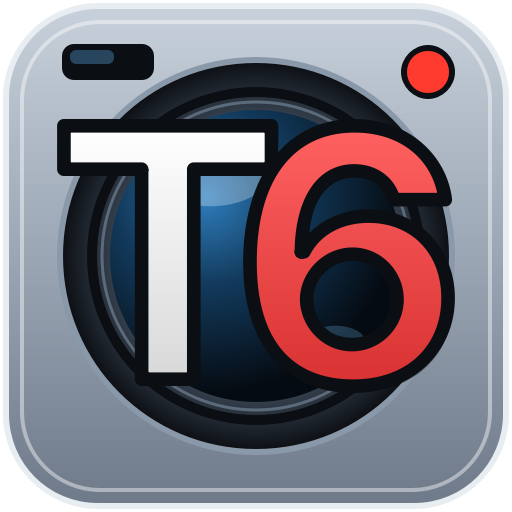

<p align="center">
  
</p>

<h1 align="center">T6 Viewer</h1>
<p align="center"><b>Tesla dashcam smart viewer</b><br>
테슬라 블랙박스(TeslaCam) 6채널 동시 재생 · 주차 중 움직임 자동 찾기 · 주행 정보 · 로컬 복호화</p>

<p align="center">
  <a href="LICENSE"></a>
  
  
</p>

> **English summary** — T6 Viewer is a Windows desktop app for reviewing Tesla dashcam and Sentry Mode
> footage. It plays all six cameras in sync with seamless clip-to-clip playback, finds the moments when
> people or vehicles actually moved in parked recordings (on-device YOLOX object tracking) and skips the
> quiet parts, shows driving telemetry (speed, gear, steering, pedals) from the SEI data on a HUD and a
> map, and decrypts 2026.20+ encrypted clips locally with your own Tesla account key. The UI is Korean.
> Unofficial project, not affiliated with Tesla, Inc.

---

## 주요 기능

- **6채널 동시 재생**: 왼쪽/오른쪽 필러, 전방, 왼쪽/오른쪽 리피터, 후방을 같은 시각으로 맞춰 재생합니다. 채널을 켜고 끌 수 있고, 더블클릭하면 한 채널을 크게 봅니다. 한 채널에서 시간을 옮겨도 돌아오면 모두 그 시각으로 맞춰집니다.
- **끊김 없는 연속 재생**: 다음 영상을 미리 열어 두었다가 끝에서 바로 이어 재생합니다(전환 약 0.1~0.3초). 이전·다음 영상 버튼이 있고, 1×·2×·4×·8×·16×·가변 속도를 지원합니다.
- **움직임 자동 찾기(주차 영상)**: 기기 안에서 도는 객체 인식(YOLOX)으로 사람·자동차·오토바이·자전거가 **실제로 움직인 구간**만 찾습니다. 서 있는 차는 셈하지 않습니다. 결과는 카메라별 아이콘과 스토리보드·재생바의 주황색 막대로 표시되고, `⏭ 스킵`·`⏩ 자동 스킵`으로 조용한 구간을 건너뜁니다.
- **주행 정보**: 영상에 담긴 SEI 데이터를 읽어 Front 영상 위 HUD에 속도·기어·조향각·방향지시등·브레이크/가속 페달·G·주행 보조 상태를 보여 줍니다. 지도에는 경로와 진행 방향 화살표를 그립니다(브이월드 국내 지도 또는 OpenStreetMap). 경로를 클릭하면 그 시각부터 재생합니다.
- **스토리보드·썸네일**: 영상마다 20구간 대표 장면을 만들고, 준비되는 대로 표시합니다.
- **목록 필터**: 열 제목을 눌러 일시(날짜·시간·요일)·복호·폴더·주행·Event로 엑셀처럼 거릅니다. 분석 진행률도 원형 아이콘으로 보여 줍니다.
- **암호화 영상 로컬 복호화(2026.20+)**: 내 Tesla 계정으로 파일별 키만 받아 이 PC에서 복호화합니다. 영상은 어디에도 업로드하지 않습니다.
- **가볍고 안정적인 동작**: 앱 전체 메모리를 4.5GB 안에서 관리하고, 채널 수에 맞춰 배속 상한을 둡니다. 분석은 여러 프로세스로 백그라운드에서 처리합니다. 분석 범위와 항목은 설정에서 고를 수 있고, 모두 끄면 재생만 합니다.

## 설치·실행

현재는 소스에서 실행합니다. 실행 파일 배포는 준비 중입니다.

- Windows 10/11 64비트, Python 3.10 이상, RAM 16GB 권장
- 영상 디코딩 라이브러리(FFmpeg, PyAV)는 패키지에 포함되어 있어 따로 설치할 필요가 없습니다.

```powershell
git clone https://github.com/zyongho/T6_Viwer.git
cd T6_Viwer
py -3.11 -m venv .venv
.venv\Scripts\Activate.ps1
python -m pip install -r requirements.txt
python run.py
```

## 사용법

1. 왼쪽 위 **📂 TeslaCam 열기**로 USB 드라이브나 `TeslaCam` 폴더를 고릅니다. 창에 끌어 놓아도 됩니다.
2. 목록에서 한 번 누르면 썸네일을 보고, 두 번 누르면 재생합니다.
3. **⚙ 설정 → 지도**에 [브이월드](https://www.vworld.kr/) API 키(무료)를 넣으면 국내 지도를 씁니다. 비워 두면 OpenStreetMap 지도(시험용)를 씁니다.
4. 자세한 사용법은 설정 창의 **❓ 도움말**(`docs/help.html`)에 있습니다.

### 암호화 영상 복호화

1. 암호화 영상이 있는 폴더를 열면 **🔓 복호화** 버튼이 나타납니다.
2. [dashcam.tesla.com](https://dashcam.tesla.com)에 로그인합니다. 브라우저 개발자 도구(F12)의 네트워크 탭에서 요청의 `Authorization: Bearer …` 값을 복사해 복호화 창에 붙여 넣습니다.
3. 프로그램은 파일별 복호화 키만 Tesla에서 받아 이 PC에서 복호화하고, 결과를 `TeslaCam_Decrypted` 폴더에 저장합니다. 토큰은 저장하지 않습니다. 본인 계정 차량의 영상만 복호화됩니다.
4. 원본 암호화 파일은 정상 MP4가 확인된 경우에만, 사용자가 선택했을 때 삭제합니다.
5. `event.json`은 영상 복호화 키로 풀 수 없어 대상에서 제외합니다. 차량에서 암호화하지 않은 event.json만 이벤트 정보로 씁니다.

## 개인정보·보안

- 영상은 외부로 보내지 않습니다. 복호화할 때 Tesla 서버로 가는 것은 파일 ID와 사용자가 넣은 토큰뿐입니다.
- 지도 타일을 받을 때, 지도 서버(브이월드 또는 OpenStreetMap)에 보고 있는 지역 정보가 전달됩니다.
- 토큰은 계정 권한입니다. 다른 사람에게 알려 주거나 이슈에 올리지 마세요.
- 보안 문제는 [SECURITY.md](SECURITY.md)에 따라 비공개로 알려 주세요.

## 저장 위치·삭제

| 내용 | 위치 |
| --- | --- |
| 설정·시청 기록·움직임 분석 목록·오류 기록·지도 캐시 | `%LOCALAPPDATA%\T6Viewer` |
| 영상별 분석 결과(썸네일·스토리보드·객체 인식·SEI) | 각 영상 폴더의 `.t6_viewer_cache` |

**⚙ 설정 → 모든 설정·기록 삭제**로 위 내용을 지우고 프로그램을 끝낼 수 있습니다. 예전 이름(MyTeslaViewer)으로 저장된 설정과 분석 결과는 처음 실행할 때 새 위치로 옮겨 씁니다.

## 알려진 제한

- Windows에서만 확인했고, 화면은 한국어만 지원합니다.
- Windows가 영상을 별도 창으로 그리므로 HUD를 영상 화면 위에 겹칠 수 없습니다. 그래서 HUD는 Front 영상 바로 위 띠에 표시합니다.
- 객체 인식은 작은 물체, 잠깐 나타난 물체, 킥보드처럼 학습되지 않은 대상을 놓칠 수 있습니다. 주행 영상은 분석하지 않습니다.
  **"변화 없음"이 아무 일도 없었다는 보장은 아닙니다.** 중요한 장면은 1×로 확인하세요.
- 배속 상한과 분석 프로세스 수의 기본값은 개발 테스트 PC(Intel i5-1340P 노트북, 내장 그래픽, RAM 16GB) 기준입니다. 설정에서 PC에 맞게 바꿀 수 있습니다.
- 복호화는 Tesla의 비공식 API를 씁니다. Tesla 쪽이 바뀌면 언제든 동작하지 않을 수 있습니다.

## 계획

- 클립 내보내기: 여러 클립·카메라·시간 구간을 골라 하나로 잇거나 카메라별로 저장하고, HUD·미니맵을 넣어 미리 본 뒤 저장

변경 내역은 [docs/CHANGELOG.md](docs/CHANGELOG.md)에 있습니다.

## 기여

버그 제보, 제안, PR 모두 환영합니다. [CONTRIBUTING.md](CONTRIBUTING.md)와 [CODE_OF_CONDUCT.md](CODE_OF_CONDUCT.md)를 먼저 읽어 주세요.
이슈에 영상·토큰·위치 정보가 담긴 파일을 올리지 마세요.

```powershell
python -m pip install pytest
python -m pytest -q
```

## 라이선스

Copyright © 2026 zyongho

이 프로그램은 [GNU Affero General Public License v3.0 이상(AGPL-3.0-or-later)](LICENSE)으로 배포됩니다.
누구나 사용·수정·재배포할 수 있습니다. 다만 수정한 프로그램을 배포하거나 네트워크 서비스로 제공하면, 그 전체 소스 코드를 같은 라이선스로 공개해야 합니다.

사용한 오픈소스 구성요소와 라이선스는 [licenses/THIRD_PARTY_NOTICES.md](licenses/THIRD_PARTY_NOTICES.md)에 있습니다
(Qt/PySide6 LGPL-3.0, FFmpeg LGPL, PyAV BSD, OpenCV·YOLOX Apache-2.0, Pretendard OFL-1.1 등).

**Tesla는 Tesla, Inc.의 상표입니다. T6 Viewer는 Tesla, Inc.와 관련이 없는 비공식 프로그램이며, Tesla가 제공하거나 보증하지 않습니다.**
이 프로그램은 있는 그대로 제공되며, 사용 결과에 대해 어떤 보증도 하지 않습니다.
